# DogBreedBot: Telegram-бот для определения породы собаки по фотографии

## Содержание

- [+ О проекте](#о-проекте)
  - [+ Цель и задача](#цель-и-задача)
  - [+ Демонстрация работы](#демонстрация-работы)
    - [+ Пример 1: Идеальное фото](#пример-1-идеальное-фото)
    - [+ Пример 2: Несколько собак в кадре](#пример-2-несколько-собак-в-кадре)
    - [+ Пример 3: Фото без собаки](#пример-3-фото-без-собаки)
  - [+ Используемые данные и технологии](#используемые-данные-и-технологии)
    - [+ Данные](#данные)
    - [+ Технологии и библиотеки](#технологии-и-библиотеки)
- [+ Архитектура модели: от детекции к классификации](#архитектура-модели-от-детекции-к-классификации)
  - [+ Обоснование выбранной архитектуры](#обоснование-выбранной-архитектуры)
  - [+ Детекция](#детекция)
  - [+ Классификация](#классификация)
- [Оценка качества модели](#оценка-качества-модели)
  - [+ Итоговая end-to-end точность](#итоговая-end-to-end-точность)
  - [+ Распределение ошибок](#распределение-ошибок)
  - [+ Анализ пропущенных случаев (11%)](#анализ-пропущенных-случаев-11)
  - [Анализ ошибок классификации (15%)](#анализ-ошибок-классификации-15)
- [Как запустить](#как-запустить)

## О проекте

**DogBreedBot** - это Telegram-бот, который помогает определить породу собаки по фотографии. Достаточно отправить изображение и бот найдёт собаку, выделит её на фото и назовёт породу на русском языке

### Цель и задача

**Главная цель проекта** - создать надёжный и удобный инструмент для определения породы собаки в реальных условиях, где пользователь может прислать:

- селфи с питомцем на заднем плане
- старое фото из архива с низким разрешением
- изображение с несколькими собаками или посторонними объектами

Для достижения этой цели был реализован **двухэтапный ML-пайплайн**, решающий следующие задачи:

- **Детекция** собаки с помощью предобученного детектора **YOLOv8s**, который находит bounding box даже при частичном закрытии животного или неудачном ракурсе
- **Автоматическая обрезка** изображения строго по координатам bounding box, чтобы исключить влияние фона, других животных и мешающих деталей на классификацию
- **Классификация** породы среди 120 классов датасета Stanford Dogs с использованием **transfer learning**: признаки извлекаются с помощью **ResNet18**, предобученной на **ImageNet**, а финальное решение принимает **Logistic Regression**, обученная на этих признаках (точность — 83.4% на валидации);
- **Отказоустойчивость**: если детектор не находит собаку (например, на фото кошка или человек), бот не пытается угадать породу, а честно сообщает, что не нашёл собаку
- **Прозрачная и пошаговая обратная связь**:
- - Бот последовательно информирует пользователя о каждом этапе обработки:
    1. сначала отправляет сообщение "🔍 Ищу собаку на фото..."
    2. затем присылает изображение с красной рамкой, выделяющей найденную собаку
    3. после этого сообщает "🧠 Анализирую породу собаки..."
    4. выдаёт результат с указанием уверенности 
- - Такой подход позволяет пользователю:
    1. контролировать, какую именно собаку анализирует бот (особенно важно при нескольких животных в кадре)
    2. оценивать корректность детекции (если рамка захватила не ту область, то можно прислать новое фото)
    3. принимать решение о доверии к ответу на основе численной уверенности модели

### Демонстрация работы
#### Пример 1: Идеальное фото

1. Пользователь присылает чёткое фото одной собаки

- 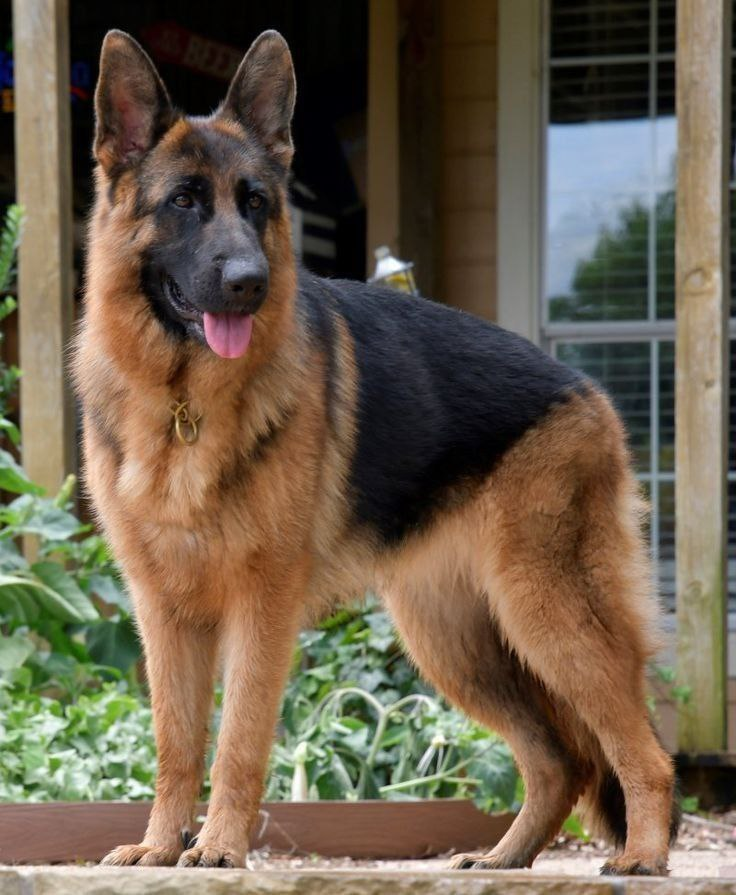

2. Бот находит собаку и выделяет ее красной рамкой

- 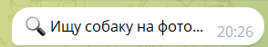

- 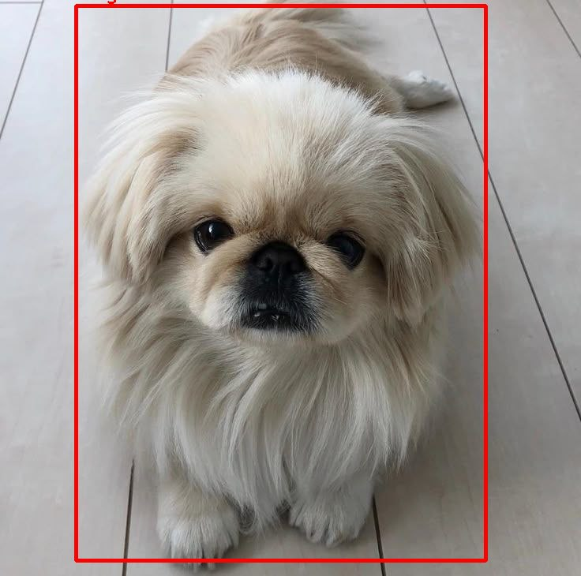

- 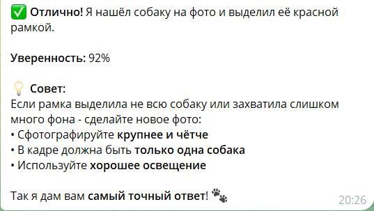

3. Называет породу на русском языке с указанием уверенности

- 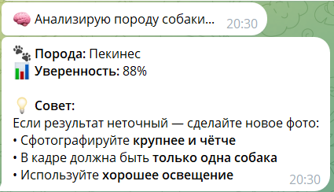

#### Пример 2: Несколько собак в кадре

1. Пользователь присылает фото с несколькими собаками

- 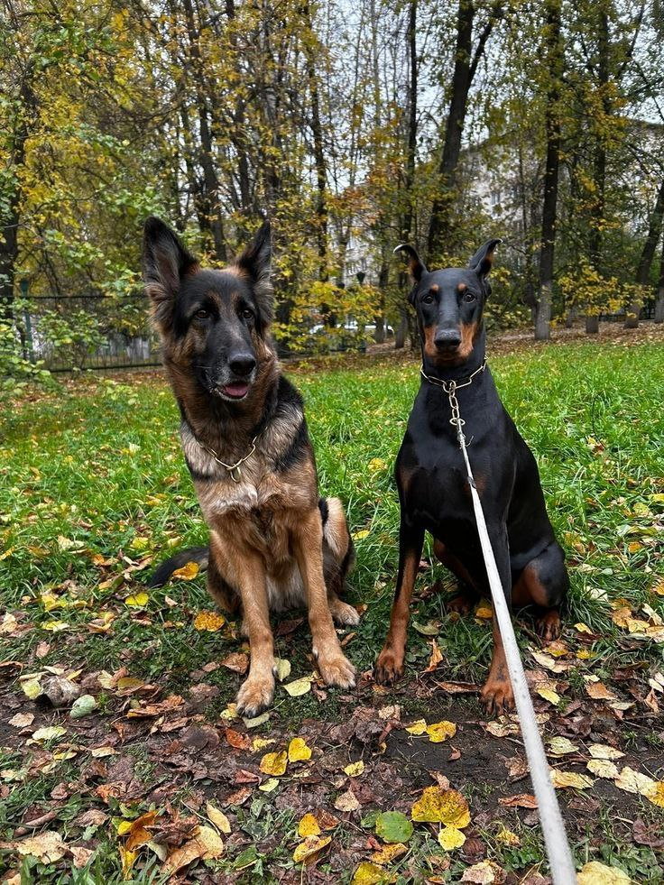

2. Бот находит собаку, в которой детектор максимально уверен и выделяет ее красной рамкой

- 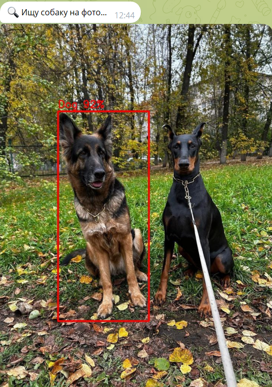

- 

- 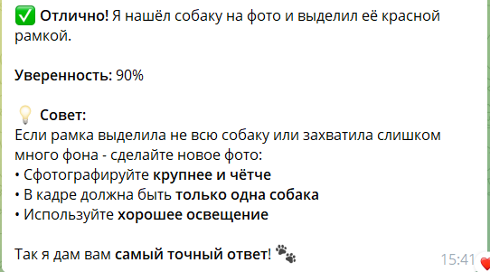

3. Называет породу на русском языке с указанием уверенности

- 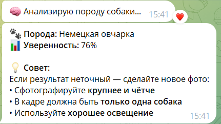

#### Пример 3: Фото без собаки

1. Пользователь присылает фото без собаки

- 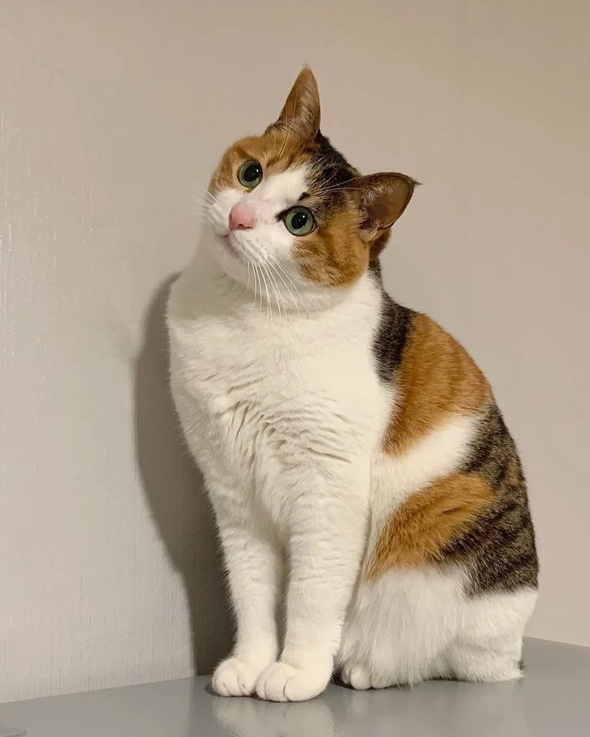

2. Бот честно сообщает, что не видит собаку и не пытается угадать породу - это предотвращает ложные срабатывания

- 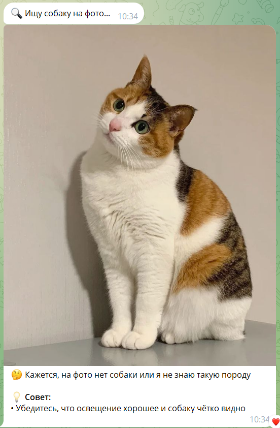

### Используемые данные и технологии
#### Данные
**Stanford Dogs Dataset**

**Описание**: коллекция из 20 580 изображений, охватывающих 120 пород собак

**Структура**: каждая порода представлена в отдельной папке (например, n02085620-Chihuahua)

**Особенности**:
- Изображения взяты из интернета с реалистичными позами, ракурсами, освещением
- Каждое фото сопровождается XML-аннотацией с координатами ограничивающего прямоугольника (bounding box) вокруг собаки

**Предобработка**:
Для обучения классификатора использовались только обрезанные изображения (по bounding box), чтобы исключить влияние фона и лишних объектов

#### Технологии и библиотеки
| Компонент                | Технология                              | Обоснование выбора                                                                 |
|--------------------------|-----------------------------------------|------------------------------------------------------------------------------------|
| Детекция объектов        | YOLOv8s (Ultralytics)                   | Лёгкая, быстрая и точная модель, отлично работающая на CPU; поддержка предобученных весов на COCO |
| Feature extraction       | ResNet18 (TorchVision, предобучена на ImageNet) | Сбалансированное соотношение точности и скорости; идеальна для transfer learning    |
| Классификация            | Logistic Regression (scikit-learn)      | Простая, интерпретируемая и эффективная модель для линейно разделимых признаков; обучается мгновенно на CPU |
| Обработка изображений    | OpenCV, Pillow (PIL)                    | Стандартные инструменты для работы с изображениями в Python                        |
| Telegram-бот             | Aiogram 3.x                             | Современный, асинхронный фреймворк с поддержкой типизированных хендлеров и удобной работы с медиа |
| Управление зависимостями | pip, requirements.txt                   | Простота развёртывания на сервере без контейнеризации                              |
| Инфраструктура           | systemd (Ubuntu 22.04)                  | Надёжное управление службой: автозапуск, логирование, перезапуск при падении       |

## Архитектура модели: от детекции к классификации
### Обоснование выбранной архитектуры

В этом проекте было принято решение разделить задачу определения породы собаки на два последовательных этапа:

- **Детекция**: найти bounding box собаки на пользовательском изображении,
- **Классификация**: определить породу только по вырезанной области, содержащей собаку

**Причины выбора такой архитектуры:**

1. Классификатор обучен только на "чистых" изображениях собак
Модель классификации породы была обучена на обработанном датасете **Stanford Dogs**, где каждое фото содержит ровно одну собаку с минимальным количеством фона. Без этапа детекции подача произвольного пользовательского изображения (с людьми, другими объектами, сложным фоном) может привести к некорректному предсказанию

2. Защита от ложных срабатываний
Без этапа детекции бот будет пытаться "угадать" породу даже на фото кошки, пейзажа или человека. Детектор явно проверяет наличие собаки и отказывается от классификации, если объект не найден

3. Фокусировка на объекте интереса
Обрезка по bounding box устраняет влияние фона, мебели, других животных и посторонних деталей, которые могут ввести классификатор в заблуждение 

4. Прозрачность и доверие (UX)
Отправка изображения с наложенной рамкой даёт пользователю визуальную обратную связь: он видит, что именно анализировалось, и может понять причину ошибки (например, если рамка охватила не всю собаку)

5. Соответствие промышленным практикам
Разделение на детекцию и классификацию - стандартный подход в production CV-системах (например, в системах распознавания лиц или автомобильных ADAS), где надёжность важнее упрощения

### Детекция

Первый этап пайплайна - обнаружение собаки на изображении пользователя. После сравнения нескольких вариантов из семейства YOLOv8 (включая `yolov8n`, `yolov8s` и `yolov8m`) на валидационной выборке Stanford Dogs была выбрана модель **YOLOv8s**, как оптимальный баланс между скоростью и качеством. На валидационной выборке она демонстрирует **recall 89%** (против **86%** у более лёгкой `yolov8n`), при этом сохраняя приемлемое время инференса

#### Как работает детекция в боте?
1. Пользователь присылает фото
2. YOLOv8s анализирует изображение и возвращает все обнаруженные объекты класса "dog" с координатами bounding box и оценкой уверенности
3. Система выбирает наиболее уверенное обнаружение (максимальный confidence score)
4. Если уверенность превышает порог, считается, что собака найдена
5. На исходном изображении рисуется красная рамка и результат отправляется пользователю

#### Обработка неудачных случаев
Если YOLOv8s не находит ни одного объекта класса "dog" или уверенность ниже порога, то бот отправляет исходное изображение без изменений, сообщает, что собака не найдена и не запускает классификацию, избегая ложных предсказаний

Такой подход гарантирует отказоустойчивость: бот никогда не называет породу, если не уверен в наличии собаки

#### Особенности работы на реальных данных
Анализ показал, что пропуски чаще всего возникают в трёх сценариях:

1. Низкое качество фото (размытие, плохая экспозиция)
2. Частичное закрытие собаки (рукой, мебелью, другим объектом)
3. Редкие породы, визуально не похожие на типичных собак из COCO (например, африканская охотничья собака).

Несмотря на это, детектор демонстрирует **recall 89%** на валидационной выборке из Stanford Dogs

#### Зачем обрезать изображение после детекции?
Даже если YOLOv8s успешно находит собаку, исходное фото часто непригодно для классификации. Вот почему:

1. **Несколько собак в кадре**

    Классификатор обучен на изображениях ровно одной собаки. Если подать фото с двумя или тремя питомцами, модель получит смешанный сигнал и, скорее всего, выдаст неправильную породу

2. **Сложный или отвлекающий фон**

    Фон (деревья, мебель, люди, игрушки) содержит текстуры и цвета, которые могут ввести классификатор в заблуждение. Например, кора дерева может быть интерпретирована как жёсткая шерсть, а ткань дивана - как окрас

3. **Собака занимает малую часть кадра**

    Если питомец снят издалека или в углу фото, его детали (форма ушей, морды, шерсть) становятся нечитаемыми для модели, обученной на крупных, чётких изображениях

Поэтому было принято решение обрезать изображение строго по bounding box, полученному от детектора.
Это изолирует объект интереса, удаляет мешающий контекст и гарантирует, что классификатор получает чистый вход, максимально приближенный к тому, на чём он обучался.

**Ниже примеры, где обрезка критически важна для корректной работы системы**

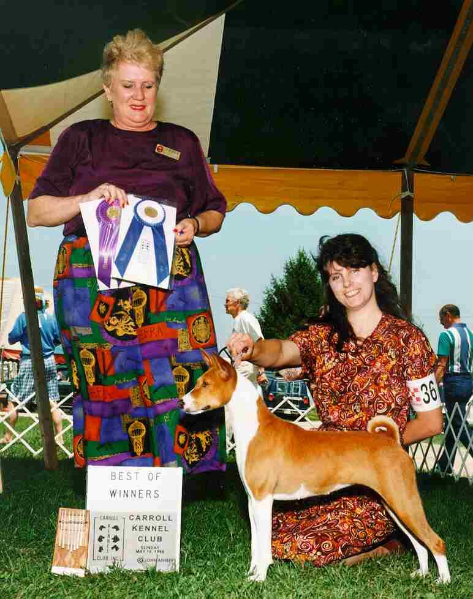

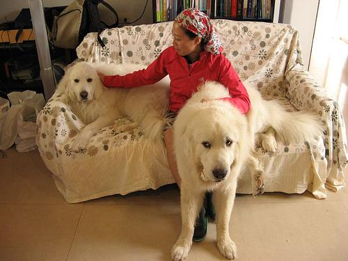

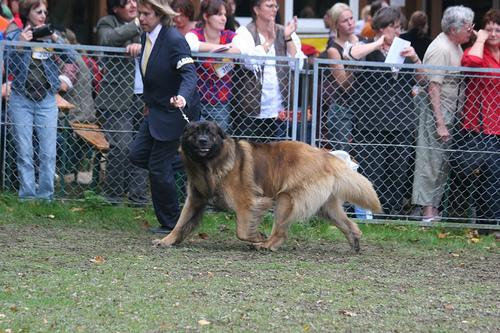

### Классификация

После успешного обнаружения и обрезки изображения собаки начинается второй этап пайплайна - определение её породы среди 120 возможных классов из датасета Stanford Dogs.

Для классификации используется двухкомпонентная модель:

1. **Feature extractor**:
    - Архитектура ResNet18, предобученная на ImageNet
    - Последний полносвязный слой заменён на nn.Identity()
    - На выходе вектор признаков размерностью 512
2. **Классификатор**:
    - Logistic Regression из библиотеки scikit-learn, обученная на признаках, извлечённых ResNet18
    - Гиперпараметры подобраны на валидационной выборке для максимизации точности

Такой подход - transfer learning без fine-tuning был выбран осознанно:

- Stanford Dogs содержит всего ~170 изображений на породу, этого недостаточно для дообучения глубокой сети без переобучения
- ResNet18, предобученная на ImageNet, уже "знает", как выглядят уши, шерсть, морда и тело собаки, этого достаточно для извлечения полезных признаков
- Logistic Regression - линейный, интерпретируемый и устойчивый к шуму классификатор, идеально подходящий для "чистых" признаков

**При получении обрезанного изображения:**

1. Оно преобразуется в тензор и нормализуется (среднее и std из ImageNet)
2. Пропускается через ResNet18 -> получаем вектор 512
3. Logistic Regression возвращает вероятности по 120 классам
4. Выбирается класс с максимальной вероятностью
5. Название породы переводится на русский язык с помощью словаря breed_translation.json
6. Пользователю отправляется сообщение с породой и уверенностью (в процентах)

После оценки качества на валидационной выборке (10% данных) финальная модель была переобучена на 100% данных. Это решение было принято осознанно и обусловлено следующими причинами:

1. Цель - максимальная точность в продакшене, а не академическая строгость

    В реальном Telegram-боте пользователь получает только один ответ — и важно, чтобы он был наиболее точным возможным. Использование всех доступных данных для обучения позволяет извлечь максимум информации из датасета

2. Нет планов по дальнейшей валидации

    После фиксации архитектуры и гиперпараметров (Logistic Regression + ResNet18 без fine-tuning) дополнительная независимая оценка не требуется, метрика на валидации уже подтвердила жизнеспособность подхода

4. Практика, принятая в индустрии

    В production-системах часто обучают финальную модель на всём датасете после подтверждения качества на валидации - это стандартный способ "выжать" последние проценты точности

## Оценка качества модели

Проект состоит из двух последовательных этапов:  
1. **Детекция** собаки на произвольном изображении (с помощью YOLOv8),  
2. **Классификация** породы по обрезанному фрагменту (с помощью ResNet18 + Logistic Regression).

Каждый этап оценивался отдельно, а затем **в совокупности**, чтобы понять, насколько точно бот работает **в реальных условиях**

---

### Итоговая end-to-end точность

- **Чувствительность детектора** (доля найденных собак среди всех реальных) = **89%**  
- **Точность классификатора** (доля верных предсказаний среди найденных собак) = **83%**

Тогда общая вероятность того, что бот **правильно назовёт породу на фото с собакой**, составляет:

$$
0.89 \times 0.83 = \mathbf{73.9\%}
$$

> Это означает: из **100** фото с настоящими собаками бот выдаст **правильный ответ в 74 случаях**.

---

### Распределение ошибок

Оставшиеся **26% случаев** распределяются так:

| Тип ошибки | Доля | Описание |
|-----------|------|--------|
| **Пропуск** | **11%** | Детектор не нашёл собаку и бот честно сообщает: "Не вижу собаку" |
| **Неверная порода** | **15%** | Детектор нашёл собаку, но классификатор ошибся |

Такой подход **избегает ложных срабатываний**: бот **никогда не называет породу, если собаки нет**
---

### Анализ пропущенных случаев (11%)

Ручной анализ изображений, которые детектор пропустил, выявил три основные причины:

1. **Низкое качество фото**  
   сильное размытие, плохая экспозиция, малое разрешение

2. **Частичное закрытие собаки**  
   питомец скрыт за другим объектом (рукой, мебелью, травой и т.п.) 
   YOLOv8 обучался на полных изображениях и не всегда распознаёт фрагментарные признаки.

3. **Редкие или визуально нестандартные породы**  
   например, **африканская охотничья собака** (African hunting dog) имеет необычную морфологию (крупные уши, пятнистая шерсть, стройное телосложение).  
   В датасете COCO (на котором обучена YOLOv8) таких пород **нет**, поэтому модель часто "не узнаёт" их как собаку

### Анализ ошибок классификации (15%)

## Как запустить